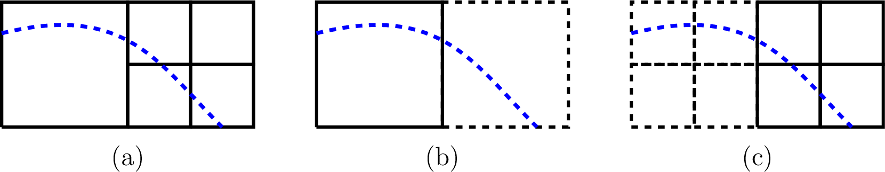
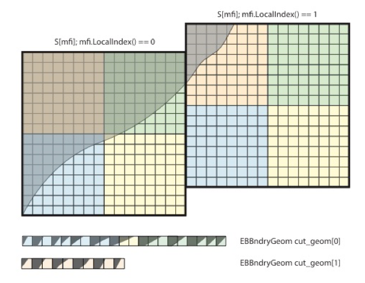

 .. role:: cpp(code)
    :language: c++

 .. role:: c(code)
    :language: c

 .. role:: fortran(code)
    :language: fortran

 .. _EB:

Geometry treatment in PeleC
===========================

The treatment of geometric features that do not align along cartesian coordinate directions effectively reduces to 
determining the correct flux terms at cut-cell interfaces and subsequent update of divergence term in each cell.
This involves the initialization and query of the necessary AMReX-provided data structures containing the 
geometry information, and computation of PeleC-specific advection and diffusion operators. The various steps in the 
process are:

1. Creation of a functional specification of the irregular geometry to embed in the uniform grid. This is done via exact 
   function representations of the geometry or implicit functions.
2. Construction of map of the (continuous) implicit representation of geometry onto the discrete mesh on all AMR levels.  
   This will be a large, complex, distributed data structure.
3. Communication of the subsets of this large data set to the local cores tasked with building the PeleC operators.
4. Actual construction of the diffusion and advection components of the PeleC time advance.

AMReX data structures and functions provide for the first 3 steps.  
Step 4 is implemented using a "method-of-lines" update within PeleC (see section :ref:`MOL<MOL>`). 

Embedded Boundary Representation
--------------------------------

.. _eb_cell_fig1:

.. figure:: EB_sample.png
   :alt: EB Cell
   :width: 400

   Embedded boundary representation of geometry

Geometry is treated in PeleC using an embedded boundary (EB) formulation, based on datastructures and algorithmic components provided by AMReX.   In the EB formalism, geometry is represented by volume fractions (:math:`v_l`) 
and apertures (:math:`A_l^k`) for each cell :math:`l` that have faces :math:`1,...,k,6`. See :ref:`EB_F` for an illustration where the grey area represents the region excluded from the solution domain and the arrows represent fluxes. The fluid volume in a given cell is given by  (:math:`V_l = v_l\,\,dx\,dy\,dz`=v_l\,dx^3`); it should be noted that the grid spacing along each direction is the same in PeleC.

.. _EB_F:

.. figure:: EB_F.png
   :alt: EB Cell
   :width: 200

   Embedded boundary representation of geometry

.. _EB_A:

.. figure:: EB_AVfrac.png
   :alt: EB Cell
   :width: 200

   Embedded boundary representation of geometry

The geometry components in AMReX are used in PeleC to implement a time-explicit integrator based on the method-of-lines.  For the advection and diffusion components of the PeleC time integrator, the time rate of change of the conserved fields, S, in cell :math:`l` can be written as 

.. math::
  \frac{dS_l}{dt} = \nabla \cdot F

where :math:`F` is the intensive flux of :math:`S` through the faces that bound the cell.

Hybrid Divergence and Redistribution
-------------------------------------
.. _HybDiv:

A straightforward implemention of the finite-volume advance of intensive conserved fields is numerically unstable (this is the well-known "small cell issue") due to presence of 
the fluid cell volume in the denominator of the conservative divergence (:math:`(DC)_l`):

.. math::
  (DC)_l = \frac{1}{V_l} \sum_{k_l} \left( F_k \cdot n_k A_k \right),

where :math:`k_l` is the number of regular and cut faces surrounding cell :math:`l` and :math:`F_k` is the intensive flux at the centroid of face :math:`k`.  An alternative update takes the so-called "non-conservative" form, constructed using a weighted average of the conservative updates of neighboring cells:

.. math::
  (DNC)_l = \frac{1}{\sum_{n_l}N_n V_l} \sum_{n_l}N_n V_n (DC)_n,

where :math:`n_l` is the number of cells in the `neighborhood` of cut cell :math:`l`. :math:`N_n` takes the value of 0 or 1 depending if cell :math:`n` is connected to cell :math:`l`. While this update is numerically stable, it does not discretely conserve the field quantities.  In PeleC, we use a hybrid update strategy, a weighted average of the two that is numerically stable and "maximally conservative" locally, without violating CFL constraints based on the regular cells:

.. math::
  (HD)_l = v_l(DC)_l + (1-v_l)(DNC)_l.

In order to maintain global conservation, the mass difference (we call the product of each conserved variable and cell volume as "mass") between the hybrid divergence and conservative divergence is a correction that is distributed to neighboring cells at each timestep:

.. math::
  \Delta_l^n = \frac{v_l(1-v_l)\left[(DC)_l - (DNC)_l\right]N_l^n W_l^n v_n^l}{\sum_{n_l}N_l^nW_l^nv_l^n}

In PeleC, this neighborhood is obtained by the AMReX function `get_neighbors`, which identifies all cells within a single step in each coordinate direction that is connected to cell :math:`l`. Two adjacent cells may be not connected if there is an embedded boundary section between them.

The redistribution is applied as:

.. math::
  (HD)_n^l = (HD)_n^l +  \frac{\Delta_l^n}{v_n^l},

and the hybrid divergence is integrated using RK2. 

The weights for redistribution :math:`W_l^n` can be set to any field in PeleC. We have found that setting the weights to the cell volumes is effective, while pure density weighting sometimes leads to stability issues when several very small cells share a neighborhood such as in a geometry corner.

This procedure is implemented in the `pc_fix_div_and_redistribute` routine that performs four steps:

 #. Recompute conservative divergence, DC, on cut cells...need DC in 2 grow cells for    final result
 #. Compute non-conservative and hybrid divergence, DNC and HD, and redistribution mass  dM in cut cells. We will need this in 1 grow cells (see below), so it depends on     having a conservative div in 2 grow cells
 #. Now that we finished computing HD and dM everywhere, it is safe to increment DC to   hold HD
 #.  Redistribute dM - THIS REQUIRES THAT DC BE GOOD IN 1 GROW CELL

    

.. highlight:: c++

::

   pc_fix_div_and_redistribute(BL_TO_FORTRAN_BOX(vbox),
                               sv_eb_bndry_geom[local_i].data(), &Ncut,
                               BL_TO_FORTRAN_ANYD(flag_fab),
                               D_DECL(BL_TO_FORTRAN_ANYD(flux_ec[0]),
                                      BL_TO_FORTRAN_ANYD(flux_ec[1]),
                                      BL_TO_FORTRAN_ANYD(flux_ec[2])),
                               sv_eb_flux[local_i].dataPtr(), &Nflux,
                               BL_TO_FORTRAN_ANYD(Dterm),
                               BL_TO_FORTRAN_N_ANYD(W, wComp),
                               BL_TO_FORTRAN_ANYD(vfrac[mfi]),
                               &VOL, &NUM_STATE,
                               &as_crse,
                               BL_TO_FORTRAN_ANYD(*p_drho_as_crse),
                               BL_TO_FORTRAN_ANYD(*p_rrflag_as_crse),
                               &as_fine,
                               BL_TO_FORTRAN_ANYD(dm_as_fine),

The arguments are the edge centered flux in the [x,y,z]-directions on the [x,y,z] faces, the array of geometry information for the cut cells for this FAB, the flux through the cut faces, and the hybrid divergence. 

Re-redistribution
-----------------

.. _eb_re_redist:

   \(a) an example situation with an EB spanning a coarse-fine boundary, (b) same situation as seen by the coarse level and (c) same situation as seen by the fine level. The cells with the dotted lines are ghost cells.

The redistribution of mass with the use of hybrid divergence method (see section :ref:`Hybrid divergence<HybDiv>`) leads 
to an accounting problem at coarse-fine interfaces that have an EB passing through them, as shown in :ref:`re-redistribution figure<eb_re_redist>` (a). 
The correct strategy will be to redistribute mass from the coarse mesh on the left side to the fine mesh on the right and vice-versa, when divergence is evaluated on the fly. 
This strategy is difficult to implement directly into the current algorithmic framework, because flux/residual calculation and time advance are done separately at 
each level with a ghost-cell treatment at coarse-fine boundaries. Therefore the mass distributed to and from ghost-cells need to be accounted and adjusted after each level has 
advanced a single time step, which we refer to as re-redistribution. Specifically, four different mass terms need to be accounted for:

*   In :ref:`re-redistribution figure<eb_re_redist>` (b) the left-coarse-real-cell distributes mass to the right-coarse-ghost-cell. This needs to be captured and given to the right-fine-real-cells.
*   In :ref:`re-redistribution figure<eb_re_redist>` (b) the right-coarse-ghost-cell distributes mass to the left-coarse-real-cell. This needs to be captured and removed from the left-coarse-real-cell update 
    because the correct distributed mass has to come from the right-fine-real-cells.
*   In :ref:`re-redistribution figure<eb_re_redist>` (c) the right-fine-real-cells distribute mass to the left-fine-ghost-cells. This needs to be captured and given to the left-coarse-real-cell.
*   In :ref:`re-redistribution figure<eb_re_redist>` (c) the left-fine-ghost-cells distribute mass to the right-fine-real-cells. This needs to be captured and removed from the right-fine-real-cells update 
    because the correct distributed mass has to come from the left-coarse-real-cell.

The re-redistribution is implemented as a book-keeping step where the mass distributed are stored during MOL divergence calculation and given to the coarse and fine flux registers to reflux at 
the end of each time step. The re-redistribution is performed everytime the reflux function is called in post_timestep. More details regarding re-redistribuion are 
presented in `Pember et al. <https://www.sciencedirect.com/science/article/pii/S0021999185711655>`_. 

Date Structures and utility functions
-------------------------------------

Several structures exist to store geometry dependent information. These are populated on creation of a new AMRLevel and stored in the PeleC object so that they are available for computation. These facilitate accessing the EB data from the fortran layer and have equivalent C++ struct and fortran types definitions so that they can be passed between the languages. The C++ struct definitions are in the file EBStencilTypes.H and the fortran type definitions are in the file EBStencilTypes_mod.F90 within the pelec_eb_stencil_types_module module. The datatypes are:

+----------------+----------------+--------------------------------------------------------------------------------------+
| C++ struct     | fortran type   | Contents                                                                             |
+================+================+======================================================================================+
| EBBoundaryGeom | eb_bndry_geom  |Cut face normal, centroid, area, index into FAB                                       |
+----------------+----------------+--------------------------------------------------------------------------------------+
| EBBndrySten    | eb_bndry_sten  |:math:`3^3` matrix of weights to apply cell based stencil, BC value, index into FAB   |
+----------------+----------------+--------------------------------------------------------------------------------------+
| FaceSten       | face_sten      |:math:`3^2` matrix of weights to apply face-based stencil                             |
+----------------+----------------+--------------------------------------------------------------------------------------+

Routines to fill and apply these as necessary can be found in the dimension specific files in e.g. Source/Src_3d/PeleC_init_eb_3d.f90 within the `nbrsTest_nd_module` module. An array of structures is created on level creation by copying data from the AMReX dense datastrcutures on a per-FAB basis as indicated in Figure :ref:`eb_structs` .

.. _eb_structs:

   Storage for sparse EB structures 

           
On creation of a new AMRLevel, data is cached from the *dense* AMReX structures in the *sparse* PeleC structures. For example, in *PeleC_init_eb.cpp* within the function initialize_eb2_structs():

.. highlight:: c++

::

   pc_fill_sv_ebg(BL_TO_FORTRAN_BOX(tbox),
   sv_eb_bndry_geom[iLocal].data(), &Ncut,
   BL_TO_FORTRAN_ANYD((*volfrac)[mfi]),
   BL_TO_FORTRAN_ANYD((*bndrycent)[mfi]),
   D_DECL(BL_TO_FORTRAN_ANYD((*eb2areafrac[0])[mfi]),
          BL_TO_FORTRAN_ANYD((*eb2areafrac[1])[mfi]),
          BL_TO_FORTRAN_ANYD((*eb2areafrac[2])[mfi])));

Where the argument FABS AMReX datastructures, e.g.:

.. highlight:: c++

::

  const amrex::MultiFab* volfrac;
  const amrex::MultiCutFab* bndrycent;
  std::array<const amrex::MultiCutFab*, AMREX_SPACEDIM> eb2areafrac;
  std::array<const amrex::MultiCutFab*, AMREX_SPACEDIM> facecent;

  const auto& ebfactory = dynamic_cast<EBFArrayBoxFactory const&>(Factory());

  // These are the data sources
  volfrac = &(ebfactory.getVolFrac());
  bndrycent = &(ebfactory.getBndryCent());
  eb2areafrac = ebfactory.getAreaFrac();
  facecent = ebfactory.getFaceCent();

Applying boundary and face stencils
~~~~~~~~~~~~~~~~~~~~~~~~~~~~~~~~~~~

When processing geometry cells, the cached datastructures can be applied efficiently, for example, to interpolate fluxes from face centers to face centroids in cut cells:

.. highlight:: c++

::

          for (int idir=0; idir < BL_SPACEDIM; ++idir) {
              int Nsten = flux_interp_stencil[idir][local_i].size();
              int in_place = 1;
              const Box valid_interped_flux_box =
              Box(amrex::grow(vbox, 2)).surroundingNodes(idir);
              {
                BL_PROFILE("PeleC::pc_apply_face_stencil call");
                pc_apply_face_stencil(BL_TO_FORTRAN_BOX(valid_interped_flux_box),
                                      BL_TO_FORTRAN_BOX(stencil_volume_box),
                                      flux_interp_stencil[idir][local_i].data(),
                                      &Nsten, &idir,
                                      BL_TO_FORTRAN_ANYD(flux_ec[idir]),
                                      BL_TO_FORTRAN_ANYD(flux_ec[idir]),
                                      &NUM_STATE, &in_place);
             }
        }

Other similar routines incldue:

* pc_apply_face_stencil
* pc_apply_eb_boundry_flux_stencil
* pc_apply_eb_boundry_visc_flux_stencil
* pc_fix_div_and_redistribute

.. include:: /geometry/geometry_init.rst

Basic work iterator for for EB geometry
---------------------------------------

First fillpatch

.. code-block:: c

    {
      FillPatchIterator fpi(*this, coeff_cc, nGrowTr, time, State_Type, 0, NUM_STATE);
      MultiFab& S = fpi.get_mf(); 
    
      cons_to_prim(S,Q,Qaux);
    
      if (level > 0) 
      {   
        const BoxArray& crse_grids = getLevel(level-1).boxArray();
        const DistributionMapping& dmc = getLevel(level-1).DistributionMap();
        MultiFab Sc(crse_grids,dmc,NUM_STATE,nGrowTr);
        FillPatch(getLevel(level-1),Sc,nGrowTr,time,State_Type,0,NUM_STATE);
    
        Qc.define(crse_grids,dmc,QVAR,nGrowTr);
        Qcaux.define(crse_grids,dmc,NQAUX>0?NQAUX:1,nGrowTr);
        cons_to_prim(Sc,Qc,Qcaux);
      }
    }

Then iterate over MultiFabs

.. code-block:: c

    EBFArrayBox& feb = static_cast<EBFArrayBox&>(Q[mfi]);
    const auto& flag_fab = feb.getEBCellFlagFab();
    FabType typ = flag_fab.getType(cbox);
    if (typ == FabType::covered)
    {
    }
    else if (typ == FabType::singlevalued)
    {
      pc_compute_tangential_vel_derivs_eb(cbox.loVect(), cbox.hiVect(),
                                          BL_TO_FORTRAN_3D(Q[mfi]),
                                          BL_TO_FORTRAN_3D(tander_ec[d]),
                                          BL_TO_FORTRAN_ANYD(flag_fab),
                                          geom.CellSize(),&d);
    }
    else if (typ == FabType::multivalued)
    {
      amrex::Abort("multi-valued eb tangential derivatives to be implemented");
    }
    else
    {
      pc_compute_tangential_vel_derivs(cbox.loVect(), cbox.hiVect(),
                                       BL_TO_FORTRAN_3D(Q[mfi]),
                                       BL_TO_FORTRAN_3D(tander_ec[d]),
                                       geom.CellSize(),&d);
    }
