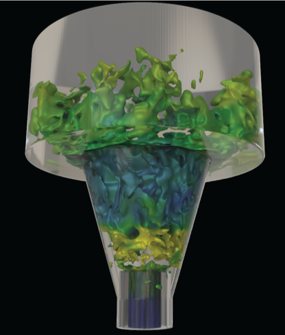
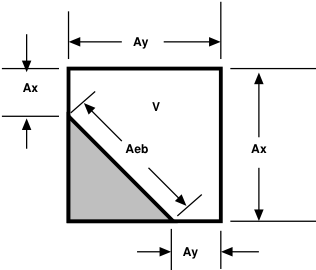

 .. role:: cpp(code)
    :language: c++

 .. role:: c(code)
    :language: c

 .. _EB:

Geometry treatment in PeleC
===========================

The treatment of geometric features that do not align along cartesian coordinate directions effectively reduces to
determining the correct flux terms at cut-cell interfaces and subsequent update of divergence term in each cell.
This involves the initialization and query of the necessary AMReX-provided data structures containing the
geometry information, and computation of PeleC-specific advection and diffusion operators. The various steps in the
process are:

1. Creation of a functional specification of the irregular geometry to embed in the uniform grid. This is done via exact
   function representations of the geometry or implicit functions.
2. Construction of map of the (continuous) implicit representation of geometry onto the discrete mesh on all AMR levels.
   This will be a large, complex, distributed data structure.
3. Communication of the subsets of this large data set to the local cores tasked with building the PeleC operators.
4. Actual construction of the diffusion and advection components of the PeleC time advance.

AMReX data structures and functions provide for the first 3 steps.
Step 4 is implemented using a "method-of-lines" update within PeleC (see section :ref:`MOL<MOL>`).

Embedded Boundary Representation
--------------------------------

.. _eb_cell_fig1:

   Embedded boundary representation of geometry

Geometry is treated in PeleC using an embedded boundary (EB) formulation, based on datastructures and algorithmic components provided by AMReX.   In the EB formalism, geometry is represented by volume fractions (:math:`v_l`)
and apertures (:math:`A_l^k`) for each cell :math:`l` that have faces :math:`1,...,k,6`. See :ref:`EB_F` for an illustration where the grey area represents the region excluded from the solution domain and the arrows represent fluxes. The fluid volume in a given cell is given by  (:math:`V_l = v_l\,\,dx\,dy\,dz`=v_l\,dx^3`); it should be noted that the grid spacing along each direction is the same in PeleC.

.. _EB_F:

.. figure:: EB_F.png
   :alt: EB Cell
   :width: 200

   Embedded boundary representation of geometry

.. _EB_A:

   Embedded boundary representation of geometry

The geometry components in AMReX are used in PeleC to implement a time-explicit integrator based on the method-of-lines.  For the advection and diffusion components of the PeleC time integrator, the time rate of change of the conserved fields, S, in cell :math:`l` can be written as

.. math::
  \frac{dS_l}{dt} = \nabla \cdot F

where :math:`F` is the intensive flux of :math:`S` through the faces that bound the cell.

Redistribution
--------------
.. _Redist:

A straightforward implementation of the finite-volume advance of intensive conserved fields is numerically unstable (this is the well-known "small cell issue") due to presence of the fluid cell volume in the denominator of the conservative divergence (:math:`(DC)_l`):

.. math::
  (DC)_l = \frac{1}{V_l} \sum_{k_l} \left( F_k \cdot n_k A_k \right),

where :math:`k_l` is the number of regular and cut faces surrounding cell :math:`l` and :math:`F_k` is the intensive flux at the centroid of face :math:`k`.

There are a number of ways to deal with this "small cell issue" and the reader is referred to the relevant discussion in `Berger, Marsha, and Andrew Giuliani. "A state redistribution algorithm for finite volume schemes on cut cell meshes." Journal of Computational Physics 428 (2021): 109820 <https://doi.org/10.1016/j.jcp.2020.109820>`_ and `Giuliani, Andrew et al. "A weighted state redistribution algorithm for embedded boundary grids" Journal of Computational Physics 464 (2022): 111305 <https://doi.org/10.1016/j.jcp.2022.111305>`_. PeleC supports the different types of redistributions described in the papers and implemented in AMReX, using the keyword ``pelec.redistribution_type``, which can have the following values:

* ``"NoRedist"``: no redistribution
* ``"FluxRedist"``: flux redistribution
* ``"StateRedist"``: weighted state redistribution

The "StateRedist" approach is the default and recommended approach. Part of this algorithm involves using limited, least squares slopes to reconstruct the state within merged cells. The slopes for each state variable are limited individually, which may introduce inconsistency between the internal energy and density that leads to negative temperatures. Therefore, these slopes are set to zero by default in PeleC for robustness. Advanced users wishing to use this feature to maintain 2nd order accuracy at the EB surface may do so by setting ``pelec.eb_srd_max_order = 2`` in their input file.

Mass fractions at the EB
------------------------
.. _EBMassFractions:

At the EB, it is possible for the hydrodynamics and diffusion operators to create out-of-bounds mass fractions (:math:`< 0` or :math:`>1`). This can happen for a variety of reasons, including because of the redistribution scheme and the flux interpolation. If this happens, a clipping procedure is applied. This clipping happens after the redistribution scheme. The divergence is used to compute an updated state. A clipping and renormalization is applied to this updated state in cells that (1) have out-of-bounds mass fractions, and (2) are a cut cell or contain a cut cell within neighborhood of one (these are affected by the redistribution scheme). The species are clipped to :math:`0 \geq \rho Y \geq \rho`. A new density is computed from these clipped values. The kinetic energy is preserved and the internal energy, total energy, and momentum is adjusted with the new density. This updated state is then used to compute an updated divergence (by differencing with the original state).

This can be controlled in the code with:

* ``"eb_clean_massfrac"``: flag to activate clipping (default to true)
* ``"eb_clean_massfrac_threshold"``: threshold for clipping, clipping is turned on if :math:`Y < -\epsilon` or :math:`1+\epsilon < Y` (default to 0)

Re-redistribution
-----------------

.. _eb_re_redist:

.. figure:: EB_re_redist.png
   :alt: EB Cell
   :width: 600

   \(a) an example situation with an EB spanning a coarse-fine boundary, (b) same situation as seen by the coarse level and (c) same situation as seen by the fine level. The cells with the dotted lines are ghost cells.

The redistribution of mass with the use of hybrid divergence method leads
to an accounting problem at coarse-fine interfaces that have an EB passing through them, as shown in :ref:`re-redistribution figure<eb_re_redist>` (a).
The correct strategy will be to redistribute mass from the coarse mesh on the left side to the fine mesh on the right and vice-versa, when divergence is evaluated on the fly.
This strategy is difficult to implement directly into the current algorithmic framework, because flux/residual calculation and time advance are done separately at
each level with a ghost-cell treatment at coarse-fine boundaries. Therefore the mass distributed to and from ghost-cells need to be accounted and adjusted after each level has
advanced a single time step, which we refer to as re-redistribution. Specifically, four different mass terms need to be accounted for:

*   In :ref:`re-redistribution figure<eb_re_redist>` (b) the left-coarse-real-cell distributes mass to the right-coarse-ghost-cell. This needs to be captured and given to the right-fine-real-cells.
*   In :ref:`re-redistribution figure<eb_re_redist>` (b) the right-coarse-ghost-cell distributes mass to the left-coarse-real-cell. This needs to be captured and removed from the left-coarse-real-cell update
    because the correct distributed mass has to come from the right-fine-real-cells.
*   In :ref:`re-redistribution figure<eb_re_redist>` (c) the right-fine-real-cells distribute mass to the left-fine-ghost-cells. This needs to be captured and given to the left-coarse-real-cell.
*   In :ref:`re-redistribution figure<eb_re_redist>` (c) the left-fine-ghost-cells distribute mass to the right-fine-real-cells. This needs to be captured and removed from the right-fine-real-cells update
    because the correct distributed mass has to come from the left-coarse-real-cell.

The re-redistribution is implemented as a book-keeping step where the mass distributed are stored during MOL divergence calculation and given to the coarse and fine flux registers to reflux at
the end of each time step. The re-redistribution is performed every time the reflux function is called in post_timestep. More details regarding re-redistribution are
presented in `Pember et al. <https://www.sciencedirect.com/science/article/pii/S0021999185711655>`_. A forthcoming paper will describe the methodology for this procedure when using state redistribution.

Data Structures and utility functions
-------------------------------------

Several structures exist to store geometry dependent information. These are populated on creation of a new AMRLevel and stored in the PeleC object so that they are available for computation. These facilitate accessing the EB data. The datatypes are:

+----------------+--------------------------------------------------------------------------------------+
| C++ struct     | Contents                                                                             |
+================+======================================================================================+
| EBBoundaryGeom |Cut face normal, centroid, area, index into FAB                                       |
+----------------+--------------------------------------------------------------------------------------+
| EBBndrySten    |:math:`3^3` matrix of weights to apply cell based stencil, BC value, index into FAB   |
+----------------+--------------------------------------------------------------------------------------+
| FaceSten       |:math:`3^2` matrix of weights to apply face-based stencil                             |
+----------------+--------------------------------------------------------------------------------------+

An array of structures is created on level creation by copying data from the AMReX dense datastructures on a per-FAB basis as indicated in Figure :ref:`eb_structs` .

.. _eb_structs:

.. figure:: EB_Struct.png
   :alt: EB Structure storage
   :width: 500

   Storage for sparse EB structures

On creation of a new AMRLevel, data is cached from the *dense* AMReX structures in the *sparse* PeleC structures.

Applying boundary and face stencils
~~~~~~~~~~~~~~~~~~~~~~~~~~~~~~~~~~~

When processing geometry cells, the cached datastructures can be applied efficiently, for example, to interpolate fluxes from face centers to face centroids in cut cells.
Two stencil types are available for computing the gradients at the EB for diffusive fluxes, and they are selected as follows:

* ``ebd.boundary_grad_stencil_type = 0``: Quadratic stencil (default). On poorly resolved geometries, this stencil may reach into covered cells, in which case the simulation will
  fail with a warning. See `Johansen and Collela <https://doi.org/10.1006/jcph.1998.5965>`_ for further details.

* ``ebd.boundary_grad_stencil_type = 1``: Least-squares stencil. See `Anderson and Bonhaus <https://doi.org/10.1016/0045-7930(94)90023-X>`_ for further details.

.. include:: /geometry/geometry_init.rst

Saving and reloading an EB geometry
-----------------------------------

These are the input option to save an EB geometry:

::

   eb2.write_chk_geom=1   # defaults to 0
   eb2.chkfile="chk_geom" # optional, defaults to "chk_geom"

These are the input options to read from a saved EB geometry:

::

   eb2.geom_type="chkfile"
   eb2.chkfile="chk_geom" # optional, defaults to "chk_geom"
   eb2.max_grid_size=32 # optional, defaults to 64, must match the max_grid_size used to generate the EB in the first place

Setting the Covered State
-------------------------

By default, the state for all cells completely covered by the EB is set to the value of the initial condition of the first valid fluid cell on the base grid.
The values in the covered region do not affect values in the fluid region, but should still have valid values because some basic operations are still
carried out in the covered region, and invalid operations or NaNs may be detected during these operations if the specified values are not valid.
For debugging purposes, one may specify ``pelec.eb_zero_body_state = true``, in which case all state variables in the covered region will be set to zero.
This will lead to NaNs when primitive variables are computed (dividing by density), but these should not propagate into fluid cells. The ``EB-C3`` RegTest
is run with this option to ensure that covered cells do not affect fluid cells.

Problem specific inflow conditions on an EB
-------------------------------------------

It is possible for the user to define problem specific conditions on an EB surface. This is done by defining an ``problem_eb_state`` function and then including `pelec.eb_problem_state = 1` in the input file. An example of this is found in the ``EB-InflowBC`` case.

.. warning:: This is a beta feature. Currently this will only affect the calculation of the hydrodynamic fluxes so this works best for advection dominated EB conditions.

Rotational frames
------------------------------

.. warning:: PeleC has limited support for simulations using rotating frames using the single-reference-frame (SRF) 
   method only in 3D and needs the MOL scheme when using this feature.

Single-reference-frame implementation
~~~~~~~~~~~~~~~~~~~~~~~~~~~~~~~~~~~~~~~

PeleC currently supports a non-inertial frame based implementation 
for rotating bodies, which are relevant for turbomachinery applications. 
The source terms for momentum and energy equations
are applied in the non-inertial reference frame for cylindrically symmetric
embedded boundaries. The total energy in the non-inertial frame is 
modified with the inclusion of rotatational kinetic energy:

.. math::
   E = e + \frac{u^2+v^2+w^2}{2} - \frac{\omega^2 r^2}{2} 

where E is the total specific energy, e is specific internal energy,
u,v,w are the velocity components, :math:`\omega` is the angular velocity, and 
r is the distance from the rotational axis.
The momentum equation includes additional source terms for 
Coriolis, centrifugal, and rotational acceleration:

.. math::

        \frac{\partial}{\partial t} (\rho \mathbf{v})+ \mathbf{\nabla} \cdot (\rho V V)=-\mathbf{\nabla}P + \mathbf{\nabla} \cdot \bar{\bar{\tau}}
        -\rho (2 \mathbf{\omega} \times \mathbf{V} + \mathbf{\omega} \times (\mathbf{\omega} \times r) + \dot{\mathbf{\omega}} \times r)

For further details, refer to Appendix A.3 
*Navier-Stokes Equations in Rotating Frame of Reference* 
in textbook *Computational fluid dynamics: principles and applications* by J. Blazek. 

Single-reference-frame usage
~~~~~~~~~~~~~~~~~~~~~~~~~~~~~~~~~

Most often in turbomachinery applications, there is rotor and 
a stator, which will be represented in PeleC as embedded boundaries.
The rotor will most often include blades and other components that are 
not rotational symmetric like a cylindrical stator surface. This capability
will solve the governing equations in the non inertial frame where the 
rotor boundary would then be a no-slip wall while the stator, which is rotationally 
symmetric, will be a slip wall. Therefore, the user in this case
has to differentiate where the stator is using ``pelec.rf_rad`` parameter that 
says anything beyond this radius will be a stator.
The rotational frame capability can be turned on by using these inputs:

::

   pelec.do_rf=1  #turn on rotational frames
   pelec.rf_omega=500.0 #rotational speed (rad/s)
   pelec.rf_axis=2      #axis of rotation (0-x,1-y,2-z)
   pelec.rf_axis_x=0.0  #x location of axis 
   pelec.rf_axis_y=0.0  #y location of axis
   pelec.rf_axis_z=0.0  #z location of axis
   pelec.rf_rad=20.0    #non-zero EB velocity beyond this radius
   pelec.do_mol = 1     #rotational frames only implemented with MOL

The velocities in the plot files will be in the rotating frame.
But, one can turn on ``amr.derive_plot_vars`` to add new variables 
that transform velocity back to inertial frame. These variable names 
include ``x_velocity_if``, ``y_velocity_if`` , ``z_velocity_if`` and 
``magvel_if``.
 
Some example test cases
~~~~~~~~~~~~~~~~~~~~~~~~~~~~~~~~~~~~~~~~~~~~~~~~~~~
We have tested this SRF implementation using a Taylor-Couette example (see ``Exec/EB_TaylorCouette``)
for which we obtain solutions matching the analytic solution as shown in
Figure :ref:`rotational-frame-verification <rotframe>` (a).

We have also done a comparison with the incompressible SRF solver in OpenFOAM for a
4 bladed rotor case (see ``Exec/EB_Rotor4Blade``). 
The solutions agree reasonably well, as shown in Figure :ref:`rotational-frame-verification <rotframe>` (b) 
with minor differences due to the compressible formulation in PeleC. 

.. _rotframe:

.. figure:: rotframetests.png
   :alt: EB Cell
   :width: 400

   \(a) solution to Taylor-Couette flow compared to analytic solution and (b) 
   comparison of velocity magntiude for a 4 blade rotor case with incompressible 
   SRF solver from OpenFOAM. 
