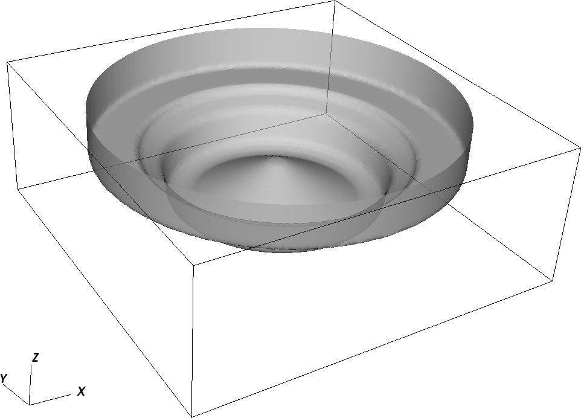

.. highlight:: rst

Geometry initialization
-----------------------

Creating an EB geometry also requires knowledge of the finest level that will be used so that geometries that 'telescope', 
i.e., coarser volume fractions are consistent with applying the coarsening operator to the finer volumes, can be created. 
To that end there is a global geometry creation step, facilitated by the `initialize_EB2` function, as well as a step that 
happens when a new AMRLevel is created. The latter happens by a call to  `PeleC::initialize_eb2_structs`  through `PeleC::init_eb` 
called from the PeleC constructor. Following construction of the geometry, the geometric information is 
copied into the structures described in the previous section and the various interpolation stencils are populated. 

Cartesian grid, embedded boundary (EB) methods are methods where the geometric description is formed by cutting a Cartesian 
mesh with surface of the geometry.  AMReX's methods to handle EB geometry information, and PeleC's treatment of the
EB aware update could use many possible sources for geometric description. The necessary information is, on a per-cell basis:

* Apertures for faces intersected by cut cells,
* cut cell volumes that 'telescope', that is, volumes at a coarser level are consistent with averaging the volumes from finer levels,
* connectivity indicating which neighbor cells are connected to a given cell, and
* coordinates of cell and face centroids. 

Additionally, the algorithms ultimately require surface normals, but these can be trivially recomputed from the aperture. 

GeometryShop and Implicit Functions
~~~~~~~~~~~~~~~~~~~~~~~~~~~~~~~~~~~

One of the greatest advantages of EB technology is that grid generation is robust and fast and can be done to any accuracy 
as described by `Schwartz et al. <http://dx.doi.org/10.2140/camcos.2015.10.83>`_ The foundation class that AMReX uses for
geometry generation is called `GeometryShop`. This class is used to initialize geometric information 
and associated connectivity graph stored in a distributed database class `EBIndexSpace`. 
Historically, the `EBIndexSpace` database was developed to be used throughout a calculation. 
Here, we use it only to populate datastructures that can be accessed efficiently in the patterns 
representative of the Pele motivating problem space. 

 Given an implicit function :math:`I`, ``GeometryShop`` interprets the surface upon which 
 :math:`I(\mathbf{x}) = 0` as the surface with which to cut the grid cells. 
 ``GeometryShop`` interprets the positive regions of the implicit function (:math:`\mathbf{x}: I(\mathbf{x}) > 0`) 
 as covered by the geometry and negative regions (:math:`\mathbf{x}: I(\mathbf{x}) < 0`) as part of  the solution domain.  
 For example, if one defines her implicit function :math:`S` as

.. math:

   S(\mathbf{x}) = x^2 + y^2 + z^2 - R^2,

the solution domain would be the interior of a sphere of radius :math:`R`. Reverse the sign of :math:`S` and the solution domain would be the exterior of the sphere. More details are available `here <https://amrex-codes.github.io/amrex/docs_html/EB.html?highlight=geometryshop#initializing-the-geometric-database>`__.

Specifying basic geometries in input files
~~~~~~~~~~~~~~~~~~~~~~~~~~~~~~~~~~~~~~~~~~

There are several basic geometries that are available in AMReX that can be easily specified in the input file, some of which are shown below:

* *Plane*    - needs a point (plane_point) and normal (plane_normal).
* *Sphere*   - needs center (sphere_center), radius (sphere_radius) and fluid inside/outside flag (sphere_has_fluid_inside).
* *Cylinder* - needs center (cylinder_center), radius (cylinder_radius), height (cylinder_height), direction (cylinder_direction) and fluid inside/outside flag (cylinder_has_fluid_inside).
* *Box*      - needs the lower corner (box_lo), upper corner (box_hi) and fluid inside/outside flag (box_has_fluid_inside). The box is aligned along coordinate directions.
* *Spline*   - needs a vector of points to create a 2D function that is a combination of spline and line elements. Currently, this geometry does not have a user interface
  from the inputs file, but can be used within Pelec_init_eb.cpp with hard coded points. see example in section :ref:`Complicated geometries`<complexGeom>`/ 

.. code::

    eb2.use_eb2 = 1
    eb2.geom_type = box
    eb2.box_lo =  -2.0  -2.0 -2.0
    eb2.box_hi =   2.0   2.0  2.0 
    eb2.box_has_fluid_inside = 0

To specify an external flow sphere geometry, add the following lines to the inputs file:

.. code::

    eb2.use_eb2 = 1
    eb2.geom_type = sphere
    eb2.sphere_radius = 0.5
    eb2.sphere_center = 2.0 2.0  2.0
    eb2.sphere_has_fluid_inside = 0

Adding complicated geometries
~~~~~~~~~~~~~~~~~~~~~~~~~~~~~
.. _complexGeom:

Geometries beyond the set described above can be built using a combination of basic geometries and EB transformation functions in AMReX.
It should be noted that building a generic geometry from a user-defined discretized surface (like STL files)  is currently being developed, nonetheless 
engineering relevant geometries can be achieved with the fundamental geometries and transformations.

Some of the relevant transformation handles in AMReX are:

* *Intersection* - find the common region between implicit functions (see AMReX_EB2_IF_Intersection.cpp)
* *Union*        - find the union of implicit functions (see AMReX_EB2_IF_Union.cpp)
* *Complement*   - invert an implicit function, i.e. make fluid that is inside to outside. (see AMReX_EB2_IF_Complement.cpp)
* *Translation* - translate an implicit function (see AMReX_EB2_IF_Translation.cpp)
* *Lathe*       - creates a 3D implicit function from a 2D function by revolving about the z axis (see AMReX_EB2_IF_Lathe.cpp)
* *Extrusion*   - creates a 3D implicit function from a 2D function by translating along the z axis (see AMReX_EB2_IF_Extrusion.cpp)

The user can copy the file "PeleC_init_eb.cpp" from the Source and add it to his/her test case after which a new geometry can be added in initialize_EB2 
function. An example of adding a piston-bowl geometry
that uses splines, cylinder, lathe and union transform, is shown below.

.. code-block:: c

    else if (geom_type == "Piston-Cylinder") {

    //spline IF object
    EB2::SplineIF Piston;

    // array of points 
    std::vector<amrex::RealVect> splpts;

    amrex::RealVect p;
    // fill array of points 
    p = amrex::RealVect(D_DECL(36.193*0.1, 7.8583*0.1, 0.0));
    spltpts.push_back(p);
    p = amrex::RealVect(D_DECL(35.924*0.1, 7.7881*0.1, 0.0));
    splpts.push_back(p);
    .
    .
    .
    .

    //add to spline elements in splineIF
    Piston.addSplineElement(splpts);

    std::vector<amrex::RealVect> lnpts;

    p = amrex::RealVect(D_DECL(22.358*0.1, -7.6902*0.1, 0.0));
    lnpts.push_back(p);
    p = amrex::RealVect(D_DECL(1.9934*0.1, 3.464*0.1, 0.0));
    lnpts.push_back(p);
    .
    .
    .
    .
    
    //add to straight line elements in splineIF
    Piston.addLineElement(lnpts);

    //create a cylinder 
    EB2::CylinderIF cylinder(48.0*0.1, 70.0*0.1, 2, {0.0, 0.0, -10.0*0.1}, true);

    //revolve the spline IF
    auto revolvePiston  = EB2::lathe(Piston);

    //make a union
    auto PistonCylinder = EB2::makeUnion(revolvePiston, cylinder);
    auto gshop = EB2::makeShop(PistonCylinder);

    
#.. _EB_pistonbowl:

   An example geometry of piston-bowl created using basic geometries.
