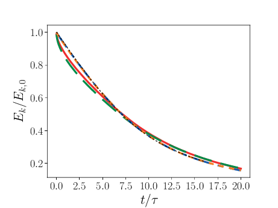
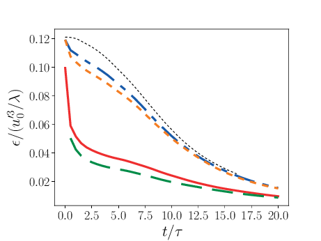
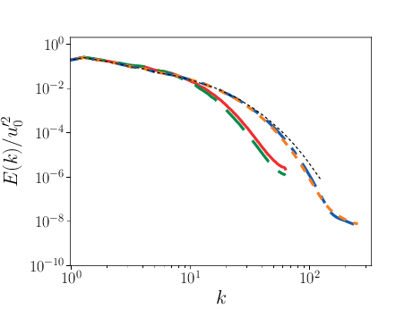

.. _GettingStarted:

.. Warning:: This documentation is a placeholder, and contents should currently be considered a work in progress, out of context, or just plain wrong until this note is removed!

Algorithms
==========

Equations
---------

Conservative system
~~~~~~~~~~~~~~~~~~~

PeleC advances the following set of fully compressible equations for the conserved state vector: :math:`\mathbf{U} = (\rho, \rho \mathbf{u}, \rho E, \rho A_k, \rho X_k, \rho Y_k):`

.. math::
 
  \begin{eqnarray}
  \frac{\partial \rho}{\partial t} &=& - \nabla \cdot (\rho \mathbf{u}) + S_{{\rm ext},\rho}, \\
  \frac{\partial (\rho \mathbf{u})}{\partial t} &=& - \nabla \cdot (\rho \mathbf{u} \mathbf{u}) - \nabla p +\rho \mathbf{g} + \mathbf{S}_{{\rm ext},\rho\mathbf{u}}, \\
  \frac{\partial (\rho E)}{\partial t} &=& - \nabla \cdot (\rho \mathbf{u} E + p \mathbf{u}) + \rho \mathbf{u} \cdot \mathbf{g} - \sum_k {\rho q_k \dot\omega_k} + \nabla\cdot k_{\rm th} \nabla T + S_{{\rm ext},\rho E}, \\
  \frac{\partial (\rho A_k)}{\partial t} &=& - \nabla \cdot (\rho \mathbf{u} A_k) + S_{{\rm ext},\rho A_k}, \\
  \frac{\partial (\rho X_k)}{\partial t} &=& - \nabla \cdot (\rho \mathbf{u} X_k) + \rho \dot\omega_k + S_{{\rm ext},\rho X_k}, \\
  \frac{\partial (\rho Y_k)}{\partial t} &=& - \nabla \cdot (\rho \mathbf{u} Y_k) + S_{{\rm ext},\rho Y_k}.\label{eq:compressible-equations}
  \end{eqnarray}

Here :math:`\rho, \mathbf{u}, T, p`, and :math:`k_{\rm th}` are the density, velocity,
temperature, pressure, and thermal conductivity, respectively, and :math:`E
= e + \mathbf{u} \cdot \mathbf{u} / 2` is the total energy with :math:`e` representing the
internal energy.  In addition, :math:`X_k` is the mass fraction of the :math:`k^{\rm th}` species,
with associated production rate, :math:`\dot\omega_k`, and
energy release, :math:`q_k`.  Here :math:`\mathbf{g}` is the gravitational vector, and
:math:`S_{{\rm ext},\rho}, \mathbf{S}_{{\rm ext}\rho\mathbf{u}}`, etc., are user-specified
source terms.  :math:`A_k` is an advected quantity, i.e., a tracer.  We also
carry around auxiliary variables, :math:`Y_k`, which have a user-defined
evolution equation, but by default are treated as advected quantities.

In the code we also carry around :math:`T` and :math:`\rho e` in the conservative
state vector even though they are derived from the other conserved
quantities.  The ordering of the elements within :math:`\mathbf{U}` is defined
by integer variables in the routine ``set_method_params`` in ``PeleC_nd.F90``.

Some notes:

* Regardless of the dimensionality of the problem, we always carry
  all 3 components of the velocity. You should always initialize all velocity components to zero, and
  always construct the kinetic energy with all three velocity components.

* There are ``NADV`` advected quantities, which range from :math:`{\tt
  UFA: UFA+nadv-1}`.  The advected quantities have no effect at all on
  the rest of the solution but can be useful as tracer quantities.

* There are ``NSPEC`` species defined in the chemistry model, which range from :math:`{\tt UFS: UFS+nspec-1}`.

* There are ``NAUX`` auxiliary variables, from :math:`{\tt UFX:UFX+naux-1}`. The auxiliary variables are passed into the equation
  of state routines along with the species.

Source Terms
~~~~~~~~~~~~

We now compute explicit source terms for each variable in $\Qb$ and
$\Ub$.  The primitive variable source terms will be used to construct
time-centered fluxes.  The conserved variable source will be used to
advance the solution.  We neglect reaction source terms since they are
accounted for in {\bf Steps 1} and {\bf 6}.  The source terms are:
\begin{equation}
\Sb_{\Qb}^n =
\left(\begin{array}{c}
S_\rho \\
\Sb_{\ub} \\
S_p \\
S_{\rho e} \\
S_{A_k} \\
S_{X_k} \\
S_{Y_k}
\end{array}\right)^n
=
\left(\begin{array}{c}
S_{{\rm ext},\rho} \\
\gb + \frac{1}{\rho}\Sb_{{\rm ext},\rho\ub} \\
\frac{1}{\rho}\frac{\partial p}{\partial e}S_{{\rm ext},\rho E} + \frac{\partial p}{\partial\rho}S_{{\rm ext}\rho} \\
\nabla\cdot\kth\nabla T + S_{{\rm ext},\rho E} \\
\frac{1}{\rho}S_{{\rm ext},\rho A_k} \\
\frac{1}{\rho}S_{{\rm ext},\rho X_k} \\
\frac{1}{\rho}S_{{\rm ext},\rho Y_k}
\end{array}\right)^n,
\end{equation}
\begin{equation}
\Sb_{\Ub}^n =
\left(\begin{array}{c}
\Sb_{\rho\ub} \\
S_{\rho E} \\
S_{\rho A_k} \\
S_{\rho X_k} \\
S_{\rho Y_k}
\end{array}\right)^n
=
\left(\begin{array}{c}
\rho \gb + \Sb_{{\rm ext},\rho\ub} \\
\rho \ub \cdot \gb + \nabla\cdot\kth\nabla T + S_{{\rm ext},\rho E} \\
S_{{\rm ext},\rho A_k} \\
S_{{\rm ext},\rho X_k} \\
S_{{\rm ext},\rho Y_k}
\end{array}\right)^n.
\end{equation}

\section{Primitive Forms}
\castro\ uses the primitive form of the fluid equations, defined in terms of
the state $\Qb = (\rho, \ub, p, \rho e, A_k, X_k, Y_k)$, to construct the
interface states that are input to the Riemann problem.

The primitive variable equations for density, velocity, and pressure are:
\begin{eqnarray}
  \frac{\partial\rho}{\partial t} &=& -\ub\cdot\nabla\rho - \rho\nabla\cdot\ub + S_{{\rm ext},\rho} \\
%
  \frac{\partial\ub}{\partial t} &=& -\ub\cdot\nabla\ub - \frac{1}{\rho}\nabla p + \gb + 
\frac{1}{\rho} (\Sb_{{\rm ext},\rho\ub} - \ub \; S_{{\rm ext},\rho}) \\
\frac{\partial p}{\partial t} &=& -\ub\cdot\nabla p - \rho c^2\nabla\cdot\ub +
\left(\frac{\partial p}{\partial \rho}\right)_{e,X}S_{{\rm ext},\rho}\nonumber\\
&&+\  \frac{1}{\rho}\sum_k\left(\frac{\partial p}{\partial X_k}\right)_{\rho,e,X_j,j\neq k}\left(\rho\dot\omega_k + S_{{\rm ext},\rho X_k} - X_kS_{{\rm ext},\rho}\right)\nonumber\\
&& +\  \frac{1}{\rho}\left(\frac{\partial p}{\partial e}\right)_{\rho,X}\left[-eS_{{\rm ext},\rho} - \sum_k\rho q_k\dot\omega_k + \nabla\cdot\kth\nabla T \right.\nonumber\\
&& \quad\qquad\qquad\qquad+\ S_{{\rm ext},\rho E} - \ub\cdot\left(\Sb_{{\rm ext},\rho\ub} - \frac{\ub}{2}S_{{\rm ext},\rho}\right)\Biggr] 
\end{eqnarray}

The advected quantities appear as:
\begin{eqnarray}
\frac{\partial A_k}{\partial t} &=& -\ub\cdot\nabla A_k + \frac{1}{\rho}
                                     ( S_{{\rm ext},\rho A_k} - A_k S_{{\rm ext},\rho} ), \\
\frac{\partial X_k}{\partial t} &=& -\ub\cdot\nabla X_k + \dot\omega_k + \frac{1}{\rho}
                                     ( S_{{\rm ext},\rho X_k}  - X_k S_{{\rm ext},\rho} ), \\
\frac{\partial Y_k}{\partial t} &=& -\ub\cdot\nabla Y_k + \frac{1}{\rho} 
                                     ( S_{{\rm ext},\rho Y_k}  - Y_k S_{{\rm ext},\rho} ).
\end{eqnarray}

All of the primitive variables are derived from the conservative state
vector, as described in Section \ref{Sec:Compute Primitive Variables}.
When accessing the primitive variable state vector, the integer variable
keys for the different quantities are listed in Table~\ref{table:primlist}.

\subsection{Internal energy and temperature}

We augment the above system with an internal energy equation:
\begin{eqnarray}
\frac{\partial(\rho e)}{\partial t} &=& - \ub\cdot\nabla(\rho e) - (\rho e+p)\nabla\cdot\ub - \sum_k \rho q_k\dot\omega_k 
                                        + \nabla\cdot\kth\nabla T + S_{{\rm ext},\rho E} \nonumber\\
&& -\  \ub\cdot\left(\Sb_{{\rm ext},\rho\ub}-\frac{1}{2}S_{{\rm ext},\rho}\ub\right), 
\end{eqnarray}\MarginPar{Since $(rho e)$ is in the conserved state, I don't think we derive the internal energy source from total and momentum sources anymore}
This has two benefits. First, for a general equation of state,
carrying around an additional thermodynamic quantity allows us to
avoid equation of state calls (in particular, in the Riemann solver,
see e.g.~\cite{colglaz}). Second, it is sometimes the case that the
internal energy calculated as 
\begin{equation}
e_T \equiv E - \frac{1}{2} \mathbf{v}^2
\end{equation}
 is
unreliable.  This has two usual causes: one, for high Mach number
flows, the kinetic energy can dominate the total gas energy, making
the subtraction numerically unreliable; two, if you use gravity or
other source terms, these can indirectly alter the value of the
internal energy if obtained from the total energy. 

To provide a more reasonable internal energy for defining the
thermodynamic state, we have implemented the dual energy formalism
from ENZO \cite{bryan:1995,bryan:2014}, where we switch between $(\rho
e)$ and $(\rho e_T)$ depending on the local state of the fluid. To do
so, we define parameters $\eta_1$, $\eta_2$, and $\eta_3$,
corresponding to the code parameters
\runparam{castro.dual\_energy\_eta1},
\runparam{castro.dual\_energy\_eta2}, and
\runparam{castro.dual\_energy\_eta3}. We then consider the ratio $e_T
/ E$, the ratio of the internal energy (derived from the total energy)
to the total energy.  These parameters are used as follows:
\begin{itemize}
\item $\eta_1$: If $e_T > \eta_1 E$, then we use $e_T$ for the purpose
  of calculating the pressure in the hydrodynamics update. Otherwise,
  we use the $e$ from the internal energy equation in our EOS call to
  get the pressure. 

\item $\eta_2$: At the end of each hydro advance, we examine whether
  $e_T > \eta_2 E$. If so, we reset $e$ to be equal to $e_T$,
  discarding the results of the internal energy equation. Otherwise,
  we keep $e$ as it is. 

  Optionally we can also update $E$ so that it gains the difference of
  the old and and new $e$, by setting
  \runparam{castro.dual\_energy\_update\_E\_from\_e} to 1.

\item $\eta_3$: Similar to $\eta_1$, if $e_T > \eta_3 E$, we use
  $e_T$ for the purposes of our nuclear reactions, otherwise, we use
  $e$.

\end{itemize}

Note that our version of the internal energy equation does not require
an artificial viscosity, as used in some other hydrodynamics
codes. The update for $(\rho e)$ uses information from the Riemann
solve to calculate the fluxes, which contains the information
intrinsic to the shock-capturing part of the scheme.

In the code we also carry around $T$ in the primitive state vector.

PeleC Timestepping
------------------

PeleC supports two options for timestepping: a second-order explicit method-of-lines approach (MOL), and an iterative scheme base on a spectral deferred correction approach (SDC). Both time-steppers share a considerable amount of code.

Standard Time Advance
~~~~~~~~~~~~~~~~~~~~~
The MOL time stepper is a standard second order predictor-corrector approach with (optional) fixed point iteration to tightly couple the reaction and transport. The advection :math:`(A)` and diffusion :math:`(D)` terms are computed using a time-explicit finite-volume formulation; reaction terms are either computed explicitly or integrated (using DVODE or CVODE via SUNDIALS), with a forcing term that incorporates the (pointwise) influence of advection and diffusion (:math:`F_{AD}`).  The update is as follows:

.. math::
   S^n &= AD(u^n) \hspace{2em} {\small \text{(stencils require grow-cell data at }t^{n}\text{)}}

   u^* &= u^n + \Delta t(S^n +I_R)

   S^{n+1} &= AD(u^*) \hspace{2em} {\small \text{(stencils require grow-cell data at }t^{n+1}\text{)}}

   u^{**} &= \frac{1}{2}(u^n+u^*) + \frac{1}{2}\left(S^{n+1}+I_R\right){\Delta t}

   F_{AD} &= \frac{1}{\Delta t} (u^{**} -u^n) - I_R

   I_R &= I_R(u^n, F_{AD})

   u^{n+1} &= u^n + \Delta t(F_{AD} +I_R)\text{.}

On initialization, the reaction term :math:`(I_R)` is evaluated with :math:`(F_{AD} = 0)`; for subsequent time steps, the initial value of :math:`(I_R)` is taken from the previous time step.  The advection and diffusion terms (evaluated above at :math:`t^n` and :math:`t^{n+1}`) require grow cells to be filled at the appropriate solution time.  The filling operation is orchestrated by the AMReX software framework via the `FillPatch` operation.  Grow cells from neighboring mesh patches (and through periodic/re-entrant boundaries) are copied on intersection in index space.  User-specified functions provide data at the physical boundaries as a function of space and time.  Cells along the coarse-fine boundary are interpolated in space and time from available coarse data (note that this requires that the fine data be "properly nested" in the coarser levels).  Also, because :math:`(A)` and :math:`(D)` are both time-explicit, they are computed together using grow cells filled by the same `FillPatch` operation.

With time-implicit reactions, the final update is iterated:

.. math::
   S^{n+1,k} &= AD(u^{n+1,k})

   F_{AD}^{k} &= \frac{1}{2}(S^n+S^{n+1,k})

   I_R^{k} &= I_R(u^n, F_{AD}^{k})

   u^{n+1,k+1} &= u^n + \Delta t(F_{AD}^{k} +I_R^{k})\text{.}

Hyperbolics
-----------

Two hyperbolic treatments are available.

PPM
~~~

The unsplit piecewise parabolic method is used for regular geometries and is the same algorithm used in several other AMReX codes including CASTRO and MAUI. 

Method of Lines with Characteristic Extrapolation
~~~~~~~~~~~~~~~~~~~~~~~~~~~~~~~~~~~~~~~~~~~~~~~~~

An alternative formulation well suited to Embedded Boundary geometry treatment and also available for regular grids is available and based on a method of lines approach.

Advective Flux Calculation
~~~~~~~~~~~~~~~~~~~~~~~~~~

The advective (hyperbolic) fluxes computation is driven by the routine pc_hyp_mol_flux found in the file Hyp_pele_MOL_3d.F90, with call signature:

.. f:function:: hyp_advection_module/pc_hyp_mol_flux

    :p q: Input state
    :p qaux: Augmented state
    :p Ax: Apertures for X edges
    :p flux1: Flux in X direction on X edges
    :p Ay: Apertures for Y edges
    :p flux2: Flux in Y direction on Y edges
    :p Az: Apertures for Z edges
    :p flux3: Flux in Z direction on Z edges
    :p flatn: Flattening parameter (not used; passed to slope routines)
    :p V: Cell volumes
    :p D: Divergence (hyperbolic fluxes added to input divergence on output)
    :p flag: Cell type flag
    :p ebflux: Flux across EB face
    :p h: Grid spacing

Within this routine, for each direction, characteristic extrapolation is used to compute left and right states at the cell faces:

.. math::
  {u^l_\perp} = u^- + \frac{1}{2\rho^-}\left( \alpha^-_2 - \alpha^-_1\right)

  {p^l} = p^- + \frac{c}{2}\left( \alpha^-_2 +\alpha^-_1\right)

  u^l_{\parallel, 1} = v^- + \frac{1}{2} \alpha^-_3

  u^l_{\parallel, 2} = w^- + \frac{1}{2} \alpha^-_4

  \rho^l Y_k^l = Y_k^-\rho^- + \frac{1}{2c}\left[\alpha^-_{4+k} + Y_k^-\left(\alpha^-_1 + \alpha^-_2\right)\right]

  \rho^l = \sum{\rho^lY_k^l}

  Y_k^l = \frac{\rho^l Y_k^l}{\rho^l}

The right states are computed as:

.. math::
  {u^r_\perp} = u^+ - \frac{1}{2\rho^+}\left( \alpha^+_2 - \alpha^+_1\right)

  {p^r} = p^+ - \frac{c}{2}\left( \alpha^+_2 +\alpha^+_1\right)

  u^r_{\parallel, 1} = v^- - \frac{1}{2} \alpha^-_3

  u^r_{\parallel, 2} = w^- - \frac{1}{2} \alpha^-_4

  \rho^r Y_k^r = Y_k^+\rho^+ - \frac{1}{2c}\left[\alpha^+_{4+k} + Y_k^+\left(\alpha^+_1 + \alpha^+_2\right)\right]

  \rho^r = \sum{\rho^rY_k^r}

  Y_k^r = \frac{\rho^r Y_k^r}{\rho^r}

The computations in the y- and z- direction are analogous; the flux on an EB face to apply a no-slip boundary condition at a wall is somewhat different. In that case, the left and right states are taken as the state at the cell center, except for the velocity is reflected across the EB face. That is:

.. math:: 
  u^l_\perp = - u \cdot \vec{n}

  u^l_{\parallel, 1} = u^l_{\parallel_2} = 0.0

  p^l = p

  Y_k^l = Y_k

  \rho^l = \rho

and, as noted the right state is identical except for:

.. math::
  u^r_\perp = - u^l_\perp

Once the left and right states are computed, a Riemann solver (in this case one preserving the physical constraints on the intermediate state) is used to compute fluxes that are assembled into a conservative and non-conservative update for the regular and cut cells.

The characteristic extrapolation requires (slope limited) fluxes; these are found in the file slope_mol_3d_EB.f90. The call signature for the slope computation is:

.. f:function:: slope_module/slopex

    :p q: Input state
    :p flatn: Flattening coefficient (not used)
    :p qaux: Augmented state (used for sound speed)
    :p flag: Cell type flag

      
Which computes the slope routines compute (limited) slopes as:

.. math::
  \Delta_1^- = 0.5\frac{1}{c}\left(p-p^-\right) - 0.5 \rho \left( u - u^-\right)  

  \Delta_2^- = 0.5\frac{1}{c}\left(p-p^-\right) + 0.5 \rho \left( u - u^-\right)  

  \Delta_3^- = v - v^-

  \Delta_4^- = w - w^-

  \Delta^-_{k=5..nspec} = \rho Y_k - \rho^- Y_k^- - \frac{1}{c^2}Y_k \left(p-p^-\right)

If cell is irregular, or neighbor to left is irregular, :math:`\Delta^- = 0.0`.

.. math::
  \Delta_1^+ = 0.5\frac{1}{c}\left(p^+ - p\right) - 0.5\rho\left(u^+ - u\right)

  \Delta_2^+ = 0.5\frac{1}{c}\left(p^+ - p\right) + 0.5\rho\left(u^+ - u\right)

  \Delta_3^+ = v^+ - v

  \Delta_4^+ = w^+ - w

  \Delta_{5...nspc}^+ = \rho^+ Y_k^+ - \rho Y_k - \frac{Y_k}{c^2}\left(p^+ - p \right)

Again, if cell is irregular, or neighbor to right is irregular, :math:`\Delta^+ = 0.0`. Finally, the slopes are limited according to:

.. math::
  \Delta_i = \frac{1}{2}\left(\Delta_i^- + \Delta_i^+\right)

  \alpha_i^{\mathrm{lim}} = \mathrm{sign}\left\{\Delta_i \right\} \cdot \min\left\{ \Delta^{lim}_i, \left|\Delta_i \right|\right\}

where:

.. math::
  \Delta^{lim} = \left\{ \begin{aligned} {} 2 \min\left\{ |\Delta^-|,|\Delta^+|\right\} \quad& \mathrm{if} \Delta^- \cdot \Delta^+ \ge 0 \\ 0 & \quad \mathrm{otherwise}\end{aligned}\right.

The formulation of the y- and z-directions is analogous to the x-direction. 

Comparison of PPM and MOL for the decay of homogeneous isotropic turbulence
~~~~~~~~~~~~~~~~~~~~~~~~~~~~~~~~~~~~~~~~~~~~~~~~~~~~~~~~~~~~~~~~~~~~~~~~~~~

Comparison of PPM and MOL were performed using the decay of
homogeneous isotropic turbulence. Initial conditions for the velocity
fields were provided by an incompressible spectral simulation. The
comparisons were performed at :math:`N=128^3` and :math:`512^3`. While
generally exhibiting similar results, the MOL is more dissipative that
the PPM, as shown in the figure below. For the MOL at :math:`N =
512^3`, the maximum relative error in kinetic energy is :math:`0.9\%`
and :math:`k_{90}= 3 k_{\lambda_0}` at :math:`t=5\tau`, for the PPM,
these numbers are :math:`0.5\%` and :math:`4 k_{\lambda_0}`. The
dissipation rate is under-predicted for the MOL. The energy spectra at
high wavenumbers for the MOL are lower than those for the
PPM. Finally, the MOL has a more restrictive CFL condition (CFL=0.3),
and, therefore, MOL simulations were approximately three times slower
than PPM simulations.

   Kinetic energy as a function of time. Solid red: PPM at :math:`N=128^3`; dashed green: MOL at :math:`N=128^3`; dot-dashed  blue: PPM at :math:`N=512^3`; dotted orange: MOL at :math:`N=128^3`; dashed black: spectral code.

   Dissipation as a function of time. Solid red: PPM at :math:`N=128^3`; dashed green: MOL at :math:`N=128^3`; dot-dashed  blue: PPM at :math:`N=512^3`; dotted orange: MOL at :math:`N=128^3`; dashed black: spectral code.

   Three dimensional energy spectrum at :math:`t = 5\tau`. Solid red: PPM at :math:`N=128^3`; dashed green: MOL at :math:`N=128^3`; dot-dashed  blue: PPM at :math:`N=512^3`; dotted orange: MOL at :math:`N=128^3`; dashed black: spectral code.

Diffusion
---------

Diffusion is modeled with a mixture average formulation.

Reaction
--------

A chemical reaction network is evaluated to determine the reaction source term.  The reaction network is selected at build time by setting the `CHEMISTRY_MODEL` flag in the makefile, where the value refers to one of the models available in `PelePhysics`. New models can be generated using `Fuego`, currently not part of `PelePhysics` but slated for inclusion in the near future.

Equation of State
-----------------

Several equation of state models are available based on ideal gas, gamma law gas or non-ideal equation of state. 
