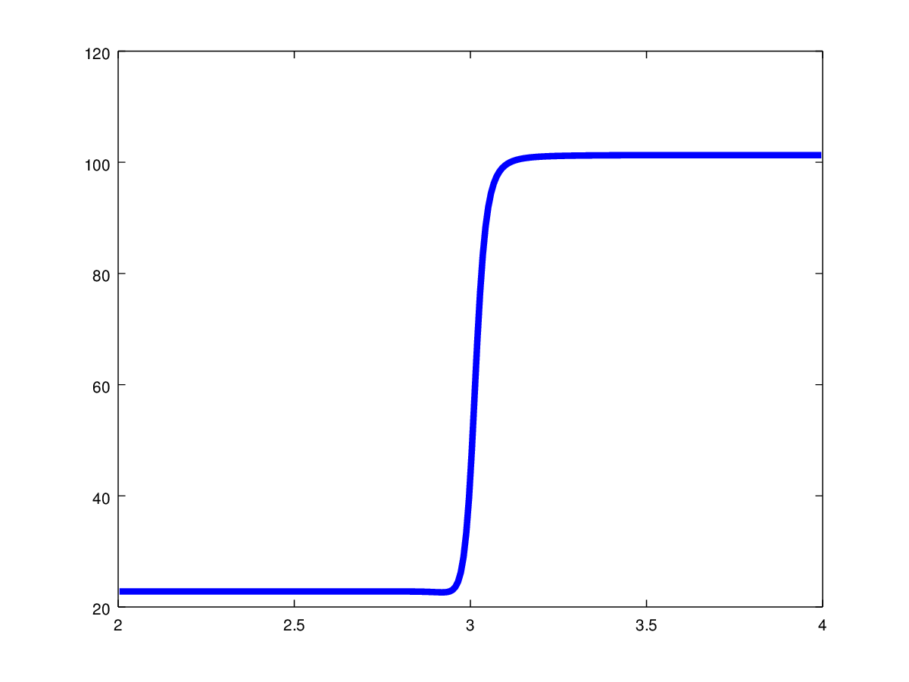

 .. role:: cpp(code)
    :language: c++
 
 .. role:: fortran(code)
    :language: fortran

 .. _BCs:

Boundary Conditions
-------------------

PeleC manages boundary conditions in a form consistent with many AMReX codes. Ghost cell data are updated at each AMR level during a ``FillPatch`` operation and
fluxes are computed the same way as it is done for interior cells without any particular treatment at the boundaries. For
that purpose, the Fortran routine `pc_hypfill` in `bc_fill_nd.F90` is called. 
There are some pre-specified boundary conditions where user intervention is not required. These are:

* *Interior* - same as periodic boundary conditions. One has to make sure the is_periodic flag is also set correctly in the inputs file
* *Symmetry* - All conserved quantities and the tangential momentum component is reflected from interior cells without 
  sign change (REFLECT_EVEN) while the normal component is reflected with a sign change (REFLECT_ODD)
* *NoSlipWall* - REFLECT_EVEN is applied to all conserved quantities except for both tangential and normal momentum components which are updated 
  using REFLECT_ODD
* *SlipWall*  - SlipWall is identical to Symmetry  

When `pc_hypfill` is called, the AMReX routine `filcc_nd` will be called to fill ghost-cells for the boundary conditions ``Interior``, ``Symmetry``,
``NoSlipWall`` and ``SlipWall``.

However more complex boundary conditions can be prescribed. This is enabled by setting the keyword ``UserBC`` in the input file. When ``UserBC`` is set, AMReX sees this boundary
with the keyword ``EXT_DIR``, which means that `filcc_nd` will do nothing and the user has to prescribe `External Dirichlet` values. For that purpose,
inside `pc_hypfill` a test is made on each face to look for the flag ``EXT_DIR``. If ``EXT_DIR`` is found, a user defined `bcnormal` routine will be called.

If a user wants to set an `Inflow` or an `Outflow` boundary condition, it could be tempting to directly impose target values in the ghost-cells (for an `Inflow`) or to perform
an extrapolation procedure to fill the ghost-cells (for an `Outflow`). Mathematically, this idea leads to an ill-posed problem and will provide wrong unphysical solutions. In order
to overcome this issue, a possibility is to prescribe the boundary conditions in terms of characteristic waves. A well-known method is the Navier-Stokes Characteristic Boundary Conditions
(NSCBC) strategy, and is described in the paper `Poinsot and Lele (1992) JCP
<https://www.sciencedirect.com/science/article/pii/0021999192900462>`_. The issue with this method is that it is formulated to impose directly boundary fluxes. Because the Godunov method
implemented in PeleC uses ghost-cells to reconstruct fluxes at faces, the NSCBC strategy has been adapted and reformulated in a way to provide the missing data for the ghost-cells. This strategy
has been called the Ghost-Cells Navier-Stokes Boundary Conditions (GC-NSCBC) method, and is described in `Motheau et al. (2017) AIAA Journal
<https://ccse.lbl.gov/people/motheau/Manuscripts_website/2017_AIAA_CFD_Motheau.pdf>`_.

Basically, the purpose of the NSCBC theory is to construct well-posed boundary conditions. At a boundary face, the solution is rewritten in terms of one-dimensional characteristic waves.
The waves leaving the domain are computed numerically, while the waves entering into the domain are provided by a model, based on a `Target State`. With the help of numerical
`relax` parameters, the contribution of entering waves can be controled so as to let some freedom at the boundary to impose a target state while letting acoustic waves to leave the domain. Thus,
unphysical waves reflections can be controlled and significantly reduced. The description of the theory is beyond the scope of this documentation, it can be found in the paper `Motheau et al. (2017) AIAA Journal
<https://ccse.lbl.gov/people/motheau/Manuscripts_website/2017_AIAA_CFD_Motheau.pdf>`_. This paper also contains examples demonstrating why imposing directly target values in ghost-cells
do not work, and why the NSCBC theory helps to get a physical solution.

Below is an example of the impact of the GC-NSCBC treatment over the wrong procedures to impose inflow with hard values in the ghost-cells, and outflow with first-order extrapolation.
A 1D profile of a flame is interpolated as an initial solution of PeleC. Because the solution has to adapt to the new grid and to the numerical solver, it creates an unphysical acoustic bump traveling through the domain.
With the incorrect way to impose boundary conditions, the unphysical acoustic wave is reflected back into the domain, perturbing the establishement of the flame. With GC-NSCBC, the acoustic wave simply leaves the computational domain and the flame is untouched.

   
   No GC-NSCBC treatment, hard values set at the left boundary for the inflow, and first order extrapolation in the right boundary to mimic an outflow. The unphysical reflections of the acoustic wave at boundary can be clearly seen.

   
   With the GC-NSCBC, the spurious acoustic wave simply leaves the domain with no unphysical reflection.

The purpose of the routine `bcnormal` is to provide the target state, as well as the numerical parameters used by the GC-NSCBC method. Note the signature and the content of the `bcnormal` routine:

::

    subroutine bcnormal(x,u_int,u_ext,dir,sgn,time,bc_type,bc_params,bc_target)

    ...
   
    integer, optional, intent(out) :: bc_type
    double precision, optional, intent(out) :: bc_params(6)
    double precision, optional, intent(out) :: bc_target(5)
    
    ...
    
    double precision :: relax_U, relax_V, relax_W, relax_T, beta, sigma_out
    integer :: flag_nscbc, which_bc_type
  
    flag_nscbc = 0
    
    ! When optional arguments are present, GC-NSCBC is activated
    ! Generic values are auto-filled for numerical parameters,
    ! but should be set by the user for each BC
    ! Note that in the impose_NSCBC_xD.f90 routine, not all parameters are used in same time
    if (present(bc_type).and.present(bc_params).and.present(bc_target)) then
      flag_nscbc = 1
      relax_U = 0.5d0 ! For inflow only, relax parameter for x_velocity
      relax_V = 0.5d0 ! For inflow only, relax parameter for y_velocity
      relax_W = 0.5d0 ! For inflow only, relax parameter for z_velocity
      relax_T = -0.2d0 ! For inflow only, relax parameter for temperature
      beta = 1.0d0  ! Control the contribution of transverse terms, here they will be discarded
      sigma_out = -0.6d0 ! For outflow only, relax parameter. A negative value means that the local Mach number will be used
      which_bc_type = Interior ! This is to ensure that nothing will be done if the user don't set anything
    endif

When `bc_type`, `bc_params` and `bc_target` are present, this means that the routine is called from `impose_NSCBC_(dir)d.F90`. Thus, the flag `flag_nscbc` is turned on to
fill the optional arrays. Because of the AMReX framework, `bcnormal` is also called from the ``FillPatch`` operation. In that case, in order to make the routine generic, only the target state is
given back to `pc_hypfill` and the parameters associated to the GC-NSCBC method are not employed. Note that by default, the Ghost-Cells Navier-Stokes Boundary Conditions
method is activated. It can be turned off by setting the flags ``nscbc_adv`` and ``nscbc_diff`` to zero. In that case, the ghost-cells will be filled with the target state.
Keep in mind that this lead to an ill-posed mathematical problem.

The use of `bc_type`, `bc_params` and `bc_target` will be described later, but let us focus on `bc_type`. The integer `bc_type` is actually the
physical boundary condition that we want to impose, and this is done pointwise. This means that along a face of the domain, different physical boundary conditions
can be combined. For example, one may want to impose an inflow in the middle of a wall, that may end to an open boundary. Four physical boundary conditions are implemented
in the GC-NSCBC framework: `Inflow`, `Outflow`, `SlipWall`, `NoSlipWall`.

`Inflow` and `Outflow` conditions rely on different models for the waves entering into the domain. This is computed in the routine `compute_waves` in `impose_NSCBC_(dir)d.F90`.
For example in 2D, `Inflow` requires models for three incoming waves. Thus, three relax parameters are needed: `relax_U`, `relax_V` and `relax_T`. Also, three state target
values are needed: `TARGET_VX`, `TARGET_VY` and `TARGET_TEMPERATURE`. For an `Outflow`, only one wave is leaving the domain, so only `TARGET_PRESSURE` is needed, and
the relax parameter is controlled with `sigma_out`. Note that transverse terms can be included in the computation of the waves, and the amount of contribution is controlled
by the parameter `beta`, comprise between 0 (full contribution) and 1 (no contribution). Note that a negative value means that `beta` will be adjusted dynamically as the local Mach
number. Once again, the user is oriented to the paper `Motheau et al. (2017) AIAA Journal
<https://ccse.lbl.gov/people/motheau/Manuscripts_website/2017_AIAA_CFD_Motheau.pdf>`_ and other reference papers for the description of the theory.

The `impose_NSCBC_(dir)d.F90` routine is organized as follows:

* First, data in ghost-cells along the direction at corners are treated. This is because we have to use a one-sided derivative to compute transverse terms at corners.
* For each cell, we compute derivatives in the normal and tengential directions of the face.
* We call bcnormal to get: the physical boundary (`bc_type`), the target state values (`bc_target`), and the associated numerical parameters (`bc_params`).
* Then we compute the NSCBC waves.
* The last step is GC-NSCBC procedure to recompute the values in ghost-cells according to the characteristic waves that have been computed in the previous step.

This procedure is done for each face of the domain.

Below is an example to achieve an inflow/outflow along the x-axis of a channel, periodic in y. Note how the `bc_params` and `bc_target` arrays are constructed at the end of the routine.

::

    subroutine bcnormal(x,u_int,u_ext,dir,sgn,time,bc_type,bc_params,bc_target)

    use probdata_module
    use eos_type_module
    use eos_module
    use meth_params_module, only : URHO, UMX, UMY, UMZ, UTEMP, UEDEN, UEINT, UFS
    use network, only: nspec, naux, molec_wt
    use prob_params_module, only : Interior, Inflow, Outflow, SlipWall, NoSlipWall, &
                                   problo, probhi
    
    
    use bl_constants_module, only: M_PI
    
    implicit none

    double precision :: x(3), time
    double precision :: u_int(*),u_ext(*)
    integer :: dir,sgn
    integer, optional, intent(out) :: bc_type
    double precision, optional, intent(out) :: bc_params(6)
    double precision, optional, intent(out) :: bc_target(5)

    type (eos_t) :: eos_state
    double precision :: u(3)
    double precision :: y
    double precision :: relax_U, relax_V, relax_W, relax_T, beta, sigma_out
    integer :: flag_nscbc, which_bc_type

    flag_nscbc = 0
    
    ! When optional arguments are present, GC-NSCBC is activated
    ! Generic values are auto-filled for numerical parameters,
    ! but should be set by the user for each BC
    ! Note that in the impose_NSCBC_xD.f90 routine, not all parameters are used in same time
    if (present(bc_type).and.present(bc_params).and.present(bc_target)) then
     
      flag_nscbc = 1
      relax_U = 0.5d0 ! For inflow only, relax parameter for x_velocity
      relax_V = 0.5d0 ! For inflow only, relax parameter for y_velocity
      relax_W = 0.5d0 ! For inflow only, relax parameter for z_velocity
      relax_T = 0.2d0 ! For inflow only, relax parameter for temperature
      beta = 0.2d0  ! Control the contribution of transverse terms
      sigma_out = 0.25d0 ! For outflow only, relax parameter
      which_bc_type = Interior ! This is to ensure that nothing will be done if the user don't set anything
    endif
    
    call build(eos_state)

    ! at low X
    if (dir == 1) then
      if (sgn == 1) then
      
        relax_U = 10.0d0
        relax_V = 2.0d0
        relax_T = - relax_V
        beta = 0.6d0  
           
        which_bc_type = Inflow
           
        u(1) = u_ref
        u(2) = 0.0d0
        u(3) = 0.0d0
        eos_state % massfrac(1) = 1.d0
        eos_state % p = p_ref
        eos_state % T = T_ref
        call eos_tp(eos_state)
    
      end if

    ! at hi X
      if (sgn == -1) then
      
        ! Set outflow pressure
        which_bc_type = Outflow      
        sigma_out = 0.28d0
        beta = -0.60d0
       
        u(1:3) = 0.d0
        eos_state % massfrac(1) = 1.d0
        eos_state % p = p_ref
        eos_state % T = T_ref
        call eos_tp(eos_state)
        
      end if
    end if
    
    ! at low Y
    if (dir == 2) then
      if (sgn == 1) then
      
        ! Do nothing, this is periodic
    
      end if

    ! at hi Y
      if (sgn == -1) then
      
       ! Do nothing, this is periodic

      end if
    end if

       u_ext(UFS:UFS+nspec-1) = eos_state % massfrac * eos_state % rho
       u_ext(URHO)               = eos_state % rho
       u_ext(UMX)                = eos_state % rho  *  u(1)
       u_ext(UMY)                = eos_state % rho  *  u(2)
       u_ext(UMZ)                = eos_state % rho  *  u(3)
       u_ext(UTEMP)              = eos_state % T
       u_ext(UEINT)              = eos_state % rho  *   eos_state % e
       u_ext(UEDEN)              = eos_state % rho  *  (eos_state % e + 0.5d0 * (u(1)**2 + u(2)**2) + u(3)**2)

    ! Here the optional parameters are filled by the local variables if they were present
    if (flag_nscbc == 1) then
      bc_type = which_bc_type
      bc_params(1) = relax_T!  For inflow only, relax parameter for temperature
      bc_params(2) = relax_U ! For inflow only, relax parameter for x_velocity
      bc_params(3) = relax_V ! For inflow only, relax parameter for y_velocity
      bc_params(4) = relax_W ! For inflow only, relax parameter for z_velocity
      bc_params(5) = beta  ! Control the contribution of transverse terms. 
      bc_params(6) = sigma_out ! For outflow only, relax parameter
      bc_target(1) = U_ext(UMX)/U_ext(URHO)  ! Target for Inflow
      bc_target(2) = U_ext(UMY)/U_ext(URHO)  ! Target for Inflow
      bc_target(3) = U_ext(UMZ)/U_ext(URHO)  ! Target for Inflow
      bc_target(4) = U_ext(UTEMP)            ! Target for Inflow
      bc_target(5) = eos_state%p             ! Target for Outflow
    end if 
    
    call destroy(eos_state)  

  end subroutine bcnormal

The choice of the relax parameters in  `bc_params` is case dependent and some trial and error process have to be done to find the best values. Some recommandations can
be given according to the litterature and practical experience:

* `relax_U`, `relax_V` and `relax_W` should be around the value of 0.2. Higher values will impose the velocity more "strongly", but it will lead to more unphysical waves reflection.
* `relax_T` must be a negative value, also around the value of 0.2.
* For outflows, a value of 0.25 if often reported to be a good choice for `sigma_out`.
* The `beta` is comprised between 0 and 1 and control the amount of the contribution of transverse terms.
The choice for this parameter is more complicated. For outflows, it should be close to the Mach number. For some cases, an averaged Mach number will provide good results,
while for other cases, the pointwise local Mach number is better. `beta` will be set to the local Mach number if it is set to a negative value. For inflows, it has been found
that a value of 0.5 provides good results but it may lead to instabilities, and for some case turning off the transverse terms (beta=1) will be better.