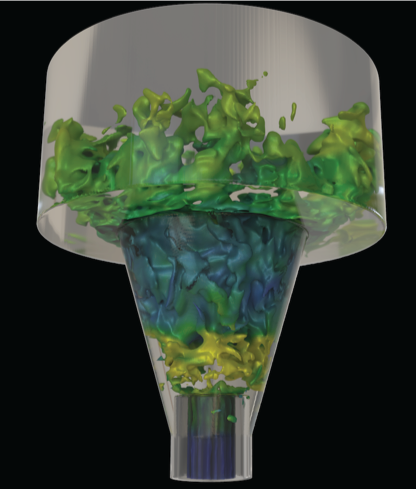
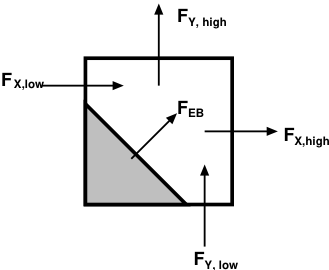

 .. role:: cpp(code)
    :language: c++

 .. role:: c(code)
    :language: c

 .. role:: fortran(code)
    :language: fortran

 .. _EB:

Embedded Boundary Representation
--------------------------------

.. _eb_cell_fig1:

   Embedded boundary representation of geometry

Geometry is treated in PeleC using an embedded boundary (EB) formulation, based on datastructures and algorithmic components provided by AMReX.   In the EB formalism, geometry is represented by volume fractions (:math:`v_l`) 
and apertures (:math:`A_l^k`) for each cell :math:`l` that have faces :math:`1,...,k,6`. See :ref:`EB_F` for an illustration where the grey area represents the region excluded from the solution domain and the arrows represent fluxes. The fluid volume in a given cell is given by  
(:math:`V_l = v_l\,\,dx\,dy\,d`); it should be noted that the grid spacing along each direction is the same in PeleC.

.. _EB_F:

   Embedded boundary representation of geometry

.. _EB_A:

.. figure:: EB_AVfrac.png
   :alt: EB Cell
   :width: 200

   Embedded boundary representation of geometry

The geometry components in AMReX are used in PeleC to implement a time-explicit integrator based on the method-of-lines.  For the advection and diffusion components of the PeleC time integrator, the time rate of change of the conserved fields, S, in cell :math:`l` can be written as 

.. math::
  \frac{dS_l}{dt} = \nabla \cdot F

where :math:`F` is the intensive flux of :math:`S` through the faces that bound the cell.

Data Structures and utility functions
-------------------------------------

Several structures exist to store geometry dependent information. These are populated on creation of a new AMRLevel and stored in the PeleC object so that they are available for computation. These facilitate accessing the EB data from the fortran layer and have equivalent C++ struct and fortran types definitions so that they can be passed between the languages. The C++ struct definitions are in the file EBStencilTypes.H and the fortran type definitions are in the file EBStencilTypes_mod.F90 within the pelec_eb_stencil_types_module module. The datatypes are:

+----------------+----------------+--------------------------------------------------------------------------------------+
| C++ struct     | fortran type   | Contents                                                                             |
+================+================+======================================================================================+
| EBBoundaryGeom | eb_bndry_geom  |Cut face normal, centroid, area, index into FAB                                       |
+----------------+----------------+--------------------------------------------------------------------------------------+
| EBBndrySten    | eb_bndry_sten  |:math:`3^3` matrix of weights to apply cell based stencil, BC value, index into FAB   |
+----------------+----------------+--------------------------------------------------------------------------------------+
| FaceSten       | face_sten      |:math:`3^2` matrix of weights to apply face-based stencil                             |
+----------------+----------------+--------------------------------------------------------------------------------------+

Routines to fill and apply these as necessary can be found in the dimension specific files in e.g. Source/Src_3d/PeleC_init_eb_3d.f90 within the `nbrsTest_nd_module` module. An array of structures is created on level creation by copying data from the AMReX dense datastrcutures on a per-FAB basis as indicated in Figure :ref:`eb_structs` .

.. _eb_structs:

.. figure:: EB_Struct.png
   :alt: EB Structure storage
   :width: 500

   Storage for sparse EB structures 

On creation of a new AMRLevel, data is cached from the *dense* AMReX structures in the *sparse* PeleC structures. For example, in *PeleC_init_eb.cpp* within the function initialize_eb2_structs():

::

   pc_fill_sv_ebg(BL_TO_FORTRAN_BOX(tbox),
   sv_eb_bndry_geom[iLocal].data(), &Ncut,
   BL_TO_FORTRAN_ANYD((*volfrac)[mfi]),
   BL_TO_FORTRAN_ANYD((*bndrycent)[mfi]),
   D_DECL(BL_TO_FORTRAN_ANYD((*eb2areafrac[0])[mfi]),
          BL_TO_FORTRAN_ANYD((*eb2areafrac[1])[mfi]),
          BL_TO_FORTRAN_ANYD((*eb2areafrac[2])[mfi])));

Where the argument FABS AMReX datastructures, e.g.:

::

 const amrex::MultiFab* volfrac;
  const amrex::MultiCutFab* bndrycent;
  std::array<const amrex::MultiCutFab*, AMREX_SPACEDIM> eb2areafrac;
  std::array<const amrex::MultiCutFab*, AMREX_SPACEDIM> facecent;

  const auto& ebfactory = dynamic_cast<EBFArrayBoxFactory const&>(Factory());

  // These are the data sources
  volfrac = &(ebfactory.getVolFrac());
  bndrycent = &(ebfactory.getBndryCent());
  eb2areafrac = ebfactory.getAreaFrac();
  facecent = ebfactory.getFaceCent();

Applying boundary and face stencils
~~~~~~~~~~~~~~~~~~~~~~~~~~~~~~~~~~~

When processing geometry cells, the cached datastructures can be applied efficiently, for example, to interpolate fluxes from face centers to face centroids in cut cells:

::

          for (int idir=0; idir < BL_SPACEDIM; ++idir) {
              int Nsten = flux_interp_stencil[idir][local_i].size();
              int in_place = 1;
              const Box valid_interped_flux_box =
              Box(amrex::grow(vbox, 2)).surroundingNodes(idir);
              {
                BL_PROFILE("PeleC::pc_apply_face_stencil call");
                pc_apply_face_stencil(BL_TO_FORTRAN_BOX(valid_interped_flux_box),
                                      BL_TO_FORTRAN_BOX(stencil_volume_box),
                                      flux_interp_stencil[idir][local_i].data(),
                                      &Nsten, &idir,
                                      BL_TO_FORTRAN_ANYD(flux_ec[idir]),
                                      BL_TO_FORTRAN_ANYD(flux_ec[idir]),
                                      &NUM_STATE, &in_place);
             }
        }

Other similar routines incldue:

* pc_apply_face_stencil
* pc_apply_eb_boundry_flux_stencil
* pc_apply_eb_boundry_visc_flux_stencil
* pc_fix_div_and_redistribute

Hybrid Divergence and Redistribution
~~~~~~~~~~~~~~~~~~~~~~~~~~~~~~~~~~~~

A straightforward implementation of the finite-volume advance of intensive conserved fields is numerically unstable (this is the well-known "small cell issue") due to presence of the fluid cell volume in the denominator of the time derivative:

.. math::
  (DC)_l = \frac{1}{V_l} \sum_{k_l} \left( F_k \cdot n_k A_k \right),

where :math:`k_l` is the number of regular and cut faces surrounding cell :math:`l` and :math:`F_k` is the intensive flux at the centroid of face :math:`k`.  An alternative update takes the so-called "non-conservative" form, constructed using a weighted average of the conservative updates of neighboring cells:

.. math::
  (DNC)_l = \frac{1}{\sum_{n_l}N_n V_l} \sum_{n_l}N_n V_n (DC)_n,

where :math:`n_l` is the number of cells in the `neighborhood` of cut cell :math:`l`. :math:`N_n` takes the value of 0 or 1 depending if cell :math:`n` is connected to cell :math:`l`. While this update is numerically stable, it does not discretely conserve the field quantities.  In PeleC, we use a hybrid update strategy, a weighted average of the two that is numerically stable and "maximally conservative" locally, without violating CFL constraints based on the regular cells:

.. math::
  (HD)_l = v_l(DC)_l + (1-v_l)(DNC)_l.

In order to maintain global conservation, the mass difference (we call the product of each conserved variable and cell volume as "mass") between the hybrid divergence and conservative divergence is a correction that is distributed to neighboring cells at each timestep:

.. math::
  \Delta_l^n = \frac{v_l(1-v_l)\left[(DC)_l - (DNC)_l\right]N_l^n W_l^n v_n^l}{\sum_{n_l}N_l^nW_l^nv_l^n}

In PeleC, this neighborhood is obtained by the AMReX function `get_neighbors`, which identifies all cells within a single step in each coordinate direction that is connected to cell :math:`l`. Two adjacent cells may be not connected if there is an embedded boundary section between them.

The redistribution is applied as:

.. math::
  (HD)_n^l = (HD)_n^l +  \frac{\Delta_l^n}{v_n^l},

and the hybrid divergence is integrated using RK2. 

The weights for redistribution :math:`W_l^n` can be set to any field in PeleC. We have found that setting the weights to the cell volumes is effective, while pure density weighting sometimes leads to stability issues when several very small cells share a neighborhood such as in a geometry corner.

This procedure is implemented in the `pc_fix_div_and_redistribute` routine:

.. f:function:: nbrsTest_nd_module/pc_fix_div_and_redistribute

    This performs four steps
        1. Recompute conservative divergence, DC, on cut cells...need DC in 2 grow cells for    final result
        2. Compute non-conservative and hybrid divergence, DNC and HD, and redistribution mass  dM in cut cells. We will need this in 1 grow cells (see below), so it depends on     having a conservative div in 2 grow cells
        3. Now that we finished computing HD and dM everywhere, it is safe to increment DC to   hold HD
        4. Redistribute dM - THIS REQUIRES THAT DC BE GOOD IN 1 GROW CELL

    This interpolates fluxes from face centers to the centroid of the uncovered part of the face 

    :p f0: Edge centered flux in x direction on x faces
    :p f1: Edge centered flux in y direction on y faces
    :p f2: Edge centered flux in z direction on z faces
    :p sv_ebg: Geometry information for cut cells
    :p ebflux: Flux through cut face
    :p DC: Divergence

.. f:function:: nbrsTest_nd_module/pc_apply_face_stencil
    This is used to apply a pre-filled stencil operation to face data.

