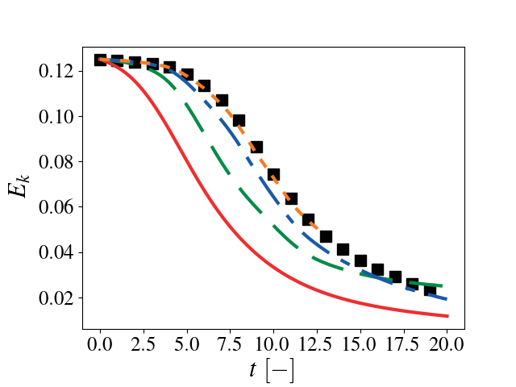
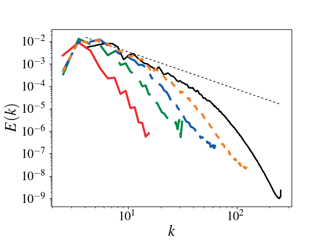

.. highlight:: rst

Validation of PeleC
===================

Decay of homogeneous isotropic turbulence
-----------------------------------------

Simulations were performed for turbulent Mach number = 0.1, Taylor
scale based Reynolds number = 100, Prandtl number = 0.71, and k0 = 4
at several different resolutions (uniform discretization, no AMR). 

The definitions for the different quantities and reference data (in
black) can be found in `Johnsen et al. (2009) JCP
<http://dx.doi.org/10.1016/j.jcp.2009.10.028>`_ and `Movahed and
Johnsen (2015) JFM <http://dx.doi.org/10.1017/jfm.2015.200>`_. VisIt
was used to post-process some quantities using `visit_pp_aux_vars.py`
(located in the Exec/HIT folder) with the command
`visit -nowin -cli -s /PATH/TO/visit_pp_aux_vars.py` in the simulation
result directory.

As the resolution increases, there is good agreement between the Pele
data and reference data.

.. figure:: ./hit/reynolds.png
   :align: center
   :figwidth: 40%

   Reynolds number as a function of time. Solid red: :math:`32^3`, dashed green :math:`64^3`, dash-dotted blue: :math:`128^3`, dotted orange: :math:`256^3`, black squares: Johnsen et al. (2009) JCP.

.. figure:: ./hit/mach.png
   :align: center
   :figwidth: 40%

   Mach number as a function of time. Solid red: :math:`32^3`, dashed green :math:`64^3`, dash-dotted blue: :math:`128^3`, dotted orange: :math:`256^3`, black squares: Johnsen et al. (2009) JCP.

.. figure:: ./hit/enstrophy.png
   :align: center
   :figwidth: 40%

   Enstrophy as a function of time. Solid red: :math:`32^3`, dashed green :math:`64^3`, dash-dotted blue: :math:`128^3`, dotted orange: :math:`256^3`, black squares: Johnsen et al. (2009) JCP.

.. figure:: ./hit/KE.png
   :align: center
   :figwidth: 40%

   Kinetic energy as a function of time. Solid red: :math:`32^3`, dashed green :math:`64^3`, dash-dotted blue: :math:`128^3`, dotted orange: :math:`256^3`.

Taylor-Green vortex breakdown
-----------------------------

This setup is one of the test problems outlined by `the High-Order CFD
workshop <https://www.grc.nasa.gov/hiocfd>`_. A complete description
of the problem can be found `at NASA HOCFDW website
<https://www.grc.nasa.gov/hiocfd/wp-content/uploads/sites/22/case_c3.3.pdf>`_
and the reference data is found `here
<https://www.grc.nasa.gov/wp-content/uploads/sites/22/C3.3_datafiles.zip>`_. More
details of the problem and methods used to obtain the reference data
can be found in Bull and Jameson (2014) 7th AIAA Theoretical Fluid
Mechanics Conference (doi: 10.2514/6.2014-3210) and DeBonis (2013)
51st AIAA Aerospace Sciences Meeting (doi:10.2514/6.2013-382).

As the resolution increases, there is good agreement between the Pele
data and reference data.

.. figure:: ./tg/dissipation.png
   :align: center
   :figwidth: 40%

   Dissipation as a function of time. Solid red: :math:`32^3`, dashed green :math:`64^3`, dash-dotted blue: :math:`128^3`, dotted orange: :math:`256^3`, black squares: HOCFDW.

.. figure:: ./tg/enstrophy.png
   :align: center
   :figwidth: 40%

   Enstrophy as a function of time. Solid red: :math:`32^3`, dashed green :math:`64^3`, dash-dotted blue: :math:`128^3`, dotted orange: :math:`256^3`, black squares: HOCFDW.

   Kinetic energy as a function of time. Solid red: :math:`32^3`, dashed green :math:`64^3`, dash-dotted blue: :math:`128^3`, dotted orange: :math:`256^3`, black: HOCFDW.

   Spectrum at :math:`t=9 t_c`. Solid red: :math:`32^3`, dashed green :math:`64^3`, dash-dotted blue: :math:`128^3`, dotted orange: :math:`256^3`, black: HOCFDW.
